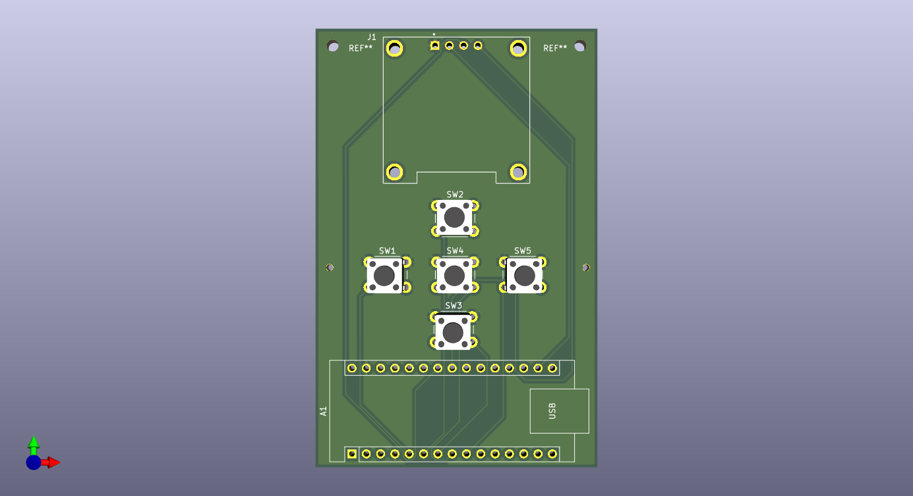

# Game_Development_board

# Game Dev Board v1.0

## Overview

Game Dev Board v1.0 is a compact handheld game development platform built around the Arduino Nano ESP32. The board combines a powerful ESP32 microcontroller, a 0.96-inch OLED display, and a five-button control interface into a simple and portable hardware platform for developing and playing retro-style games.

The project was designed as a beginner-friendly embedded systems platform that allows students, hobbyists, and makers to learn microcontroller programming, game development, PCB design, and embedded user interface design. The board can be programmed using the Arduino IDE and supports a wide range of applications beyond gaming, including menu-driven interfaces, portable utilities, educational projects, and IoT demonstrations.

The custom PCB integrates all required hardware components into a compact form factor, eliminating the need for breadboards and loose wiring while providing a reliable and reusable development platform.

---

## Objectives

* Design a custom PCB using KiCad.
* Create a portable game development platform based on the ESP32.
* Provide a simple user interface using an OLED display and push buttons.
* Enable learning of embedded programming and hardware design.
* Develop an open-source hardware project that can be modified and expanded by other users.

---

## Hardware Architecture

The system consists of three primary subsystems:

### Processing Unit

The Arduino Nano ESP32 acts as the main controller of the system. It executes game logic, reads user inputs, updates display content, and manages all interactions between hardware components.

### Display System

A 0.96-inch OLED display provides visual output. The display communicates with the ESP32 using the I2C protocol through the SDA and SCL communication lines. Game graphics, menus, scores, animations, and text are rendered on the OLED screen.

### Input System

Five push buttons are used as user controls:

* Up
* Down
* Left
* Right
* Action / Select

Each button is connected to a dedicated GPIO pin on the ESP32 and uses the internal pull-up resistors available within the microcontroller. Pressing a button pulls the corresponding GPIO pin to ground, allowing the ESP32 to detect user input.

---

## Working Principle

When power is supplied through the USB-C connector of the Arduino Nano ESP32, the microcontroller initializes the OLED display and configures the GPIO pins connected to the buttons.

The ESP32 continuously scans the state of all five buttons. When a button is pressed, the corresponding GPIO state changes, allowing the software to identify the user's command.

Based on the button input, the game logic updates internal variables such as player position, menu selection, scores, or game states. The updated information is then sent to the OLED display through the I2C communication bus.

This process repeats continuously, creating a responsive interactive gaming experience. The high processing capability of the ESP32 enables smooth graphics updates, efficient input handling, and support for more advanced game mechanics than traditional 8-bit microcontrollers.

---

## System Flow

Power ON

↓

Initialize ESP32

↓

Initialize OLED Display

↓

Configure Button Inputs

↓

Display Startup Screen

↓

Read Button States

↓

Process User Input

↓

Execute Game Logic

↓

Update OLED Display

↓

Repeat Continuously

---

## Features

* Arduino Nano ESP32 based architecture
* Compact custom PCB design
* 0.96-inch OLED display
* Five-button gaming interface
* USB-powered operation
* Open-source hardware design
* Easy programming through Arduino IDE
* Suitable for game development and embedded learning
* Expandable architecture for future upgrades

---

## Applications

* Retro handheld games
* Educational embedded systems projects
* User interface experimentation
* Menu-driven embedded devices
* Embedded programming practice
* IoT display and control systems
* Portable utility devices

---

## Future Improvements

* Battery-powered operation
* Charging circuit integration
* Buzzer or speaker output
* Larger color display
* Additional action buttons
* SD card support
* Multiplayer communication
* Wi-Fi based game features
* Custom 3D printed enclosure

---

